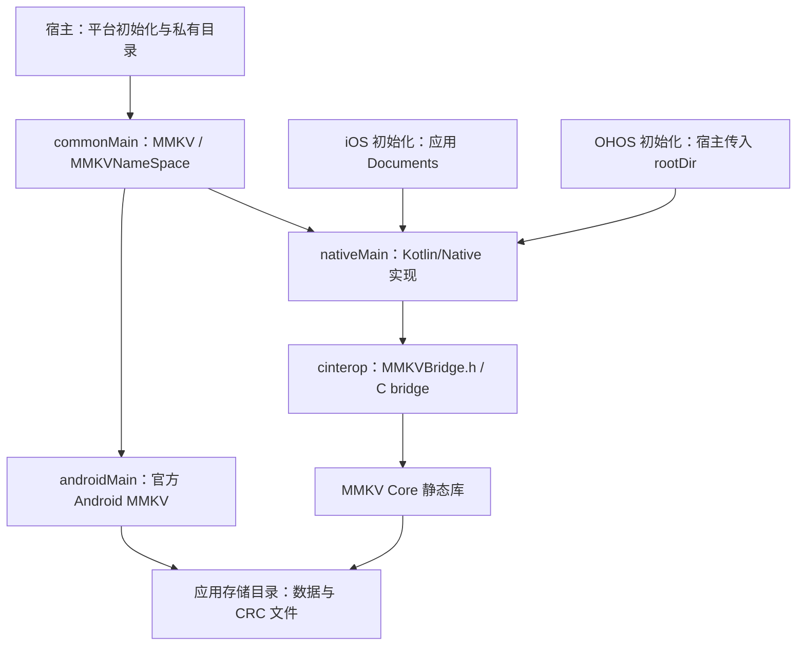
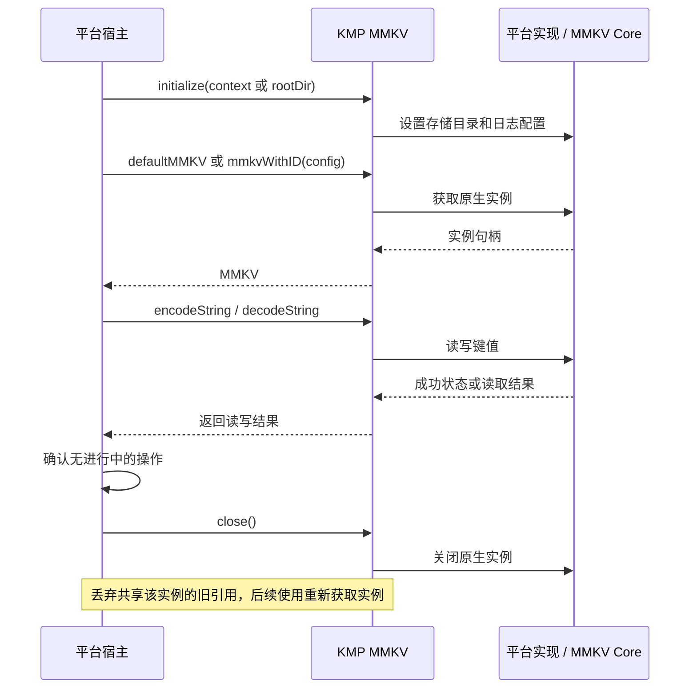
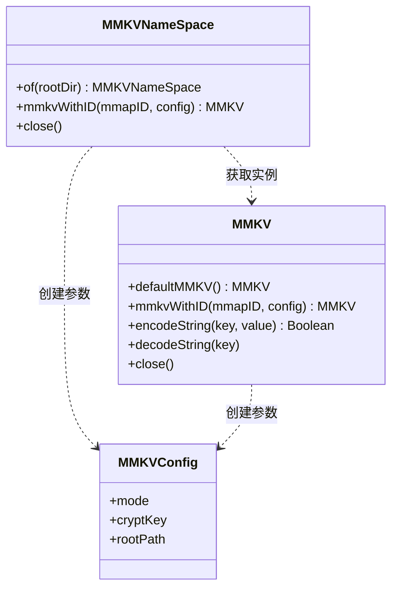

# GY CrossKit MMKV OpenHarmony

本库提供基础设施 Core，CMP/Kuikly 使用相同平台实现；没有独立 UI 模块。 五种消费入口、公开功能组、平台限制及 **2.4.2-ohos-2.2.21-5**的验证范围见 [功能与平台差异](docs/功能与平台差异.md)。发布状态以对应 [Release](https://github.com/gycrosskit/mmkv-ohos/releases/tag/2.4.2-ohos-2.2.21-5) 为准；设备验收边界见功能页。

为 Android、iOS 和 OpenHarmony 的 Kotlin Multiplatform 共享代码提供 MMKV 键值存储。基于 [Tencent/MMKV 2.4.2](https://github.com/Tencent/MMKV)，在上游实验性 KMP 模块中增加 `ohosArm64`，保留 `com.tencent.mmkv.kmp` API。

## 架构与调用流程

本 fork 维护 KMP 与 OpenHarmony 适配，公共 API 沿用上游 `com.tencent.mmkv.kmp`。共享代码使用同一组读写接口，初始化仍由各平台宿主完成。



Android AAR 传递依赖官方 Android 库；iOS/OHOS KLIB 经 C bridge 链接 Core，无需为此另装 ArkTS MMKV 包。上图描述 KMP 接入路径，不覆盖上游 Flutter、Python 等产品。



`initialize` 是各平台定义的 `MMKV.Companion` 扩展函数，不是三端通用的单一签名。类图中的虚线为创建/使用关系，`MMKVConfig` 是参数，不表示实例永久持有它。



源码入口：[MMKV API](KMP/mmkv/src/commonMain/kotlin/com/tencent/mmkv/kmp/MMKV.kt)、[命名空间](KMP/mmkv/src/commonMain/kotlin/com/tencent/mmkv/kmp/MMKVNameSpace.kt)、[创建配置](KMP/mmkv/src/commonMain/kotlin/com/tencent/mmkv/kmp/MMKVConfig.kt)、[Native 实现](KMP/mmkv/src/nativeMain/kotlin/com/tencent/mmkv/kmp/MMKV.native.kt)、[OHOS 初始化](KMP/mmkv/src/ohosArm64Main/kotlin/com/tencent/mmkv/kmp/MMKV.ohos.kt)、[C bridge 链接定义](KMP/mmkv/nativeInterop/cinterop/mmkv.def)。

## 平台与要求

| 平台 | 发布变体 | 系统 / 工具链要求 |
| --- | --- | --- |
| Android | Android AAR | minSdk 23；启用 AndroidX，传递依赖官方 `com.tencent:mmkv:2.4.2` |
| iOS | `iosArm64`、`iosSimulatorArm64`、`iosX64` | 最低部署 iOS 13.0；编译/链接需要 macOS / Xcode |
| OpenHarmony | `ohosArm64` | OHOS Native SDK；宿主提供应用私有可写目录并打包最终 `.so` |

当前发布使用 Kotlin `2.2.21-1.0.0` 的 OpenHarmony 工具链。普通 Kotlin `2.2.21` 不提供 `ohosArm64()`；建议消费者使用同一工具链。仓库构建基线为 JDK 17 / Gradle 8.14.3 / AGP 8.10.1。OHOS 最低系统版本尚未由设备验收确定。

## 安装

在项目的 `settings.gradle.kts` 中加入：

```kotlin
dependencyResolutionManagement {
    repositories {
        google()
        mavenCentral()
        maven { url = uri("https://jitpack.io") }
    }
}
```

在共享模块的 `build.gradle.kts` 中添加：

```kotlin
kotlin {
    sourceSets {
        commonMain.dependencies {
            implementation("com.github.gycrosskit.mmkv-ohos:mmkv-kmp:2.4.2-ohos-2.2.21-5")
        }
    }
}
```

Gradle 根据 KMP 元数据选择平台产物。iOS/OHOS KLIB 通过 C bridge 携带 MMKV Core 静态库，鸿蒙 KMP 消费者无需另加 `@tencent/mmkv` ohpm 包。

## 初始化与使用

首次读写前，在对应平台源码中初始化：

```kotlin
import com.tencent.mmkv.kmp.MMKV
import com.tencent.mmkv.kmp.initialize

// androidMain：Application.onCreate 中传入 Application Context
MMKV.initialize(applicationContext)

// iosMain：默认使用应用 Documents 下的 mmkv 目录
MMKV.initialize()

// ohosArm64Main：rootDir 由宿主提供，为应用私有、可写目录
MMKV.initialize(rootDir)
```

三种初始化方式分别用于对应平台；之后 `commonMain` 可以共享读写代码：

```kotlin
import com.tencent.mmkv.kmp.MMKV

val store = MMKV.defaultMMKV()
val saved = store.encodeString("name", "MMKV")
val name = store.decodeString("name")
```

`close()` 会销毁对应的原生实例，使共享该实例的所有旧引用失效。调用前须确保没有进行中的操作，之后丢弃旧引用。一个 iOS 二进制中同时链接本 KMP 库和原生 MMKV CocoaPod / SwiftPM 产品可能产生重复 MMKV Core 符号。

## 文档与支持

- [KMP 接入指南](KMP/README.md)：各平台初始化、生命周期与打包限制。
- [开发与验证](KMP/DEVELOPMENT.md)：源码构建、独立消费验证和发布归档。
- [上游中文说明](README_CN.md)、[上游英文说明](https://github.com/Tencent/MMKV/blob/master/README.md)：MMKV 通用用法；上游 `com.tencent:mmkv-kmp` 坐标不代表本 fork 的鸿蒙版本。
- [GitHub Releases](https://github.com/gycrosskit/mmkv-ohos/releases)：版本与 Maven 归档；JitPack 从相同版本 Release 提供远程依赖。
- [GitHub Issues](https://github.com/gycrosskit/mmkv-ohos/issues)：提供版本、平台、初始化方式及最小复现。

已有验证覆盖 Android 消费编译、iOS Framework 链接、OHOS 动态库/可执行文件链接，以及鸿蒙模拟器上的原生 C bridge 读写。ArkTS 宿主调用、真机运行及与 ArkTS MMKV 共存尚未验证；KMP 链接结果不等于完整宿主验收。

源码和衍生代码沿用上游 BSD 3-Clause 许可；第三方依赖的许可与声明一并见 [LICENSE.TXT](LICENSE.TXT)。
